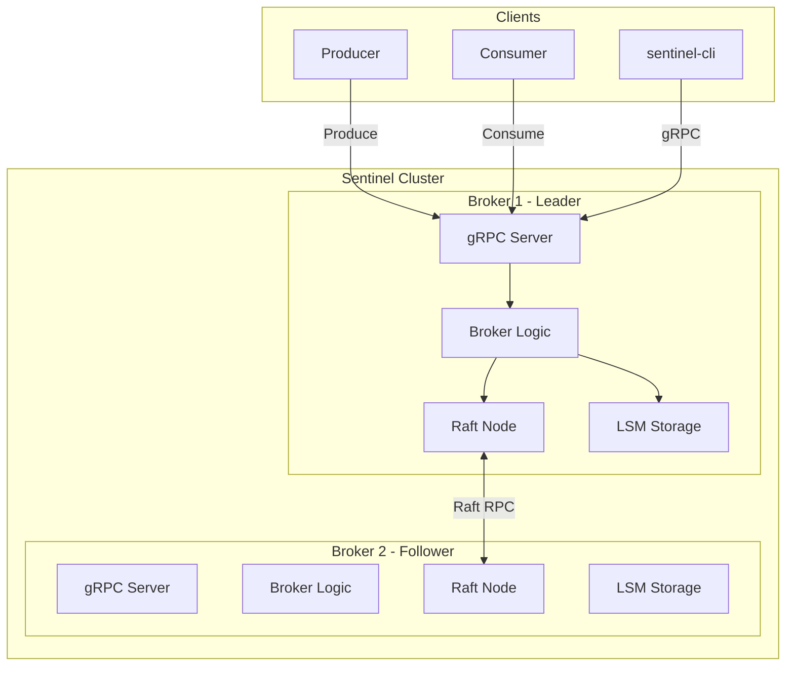
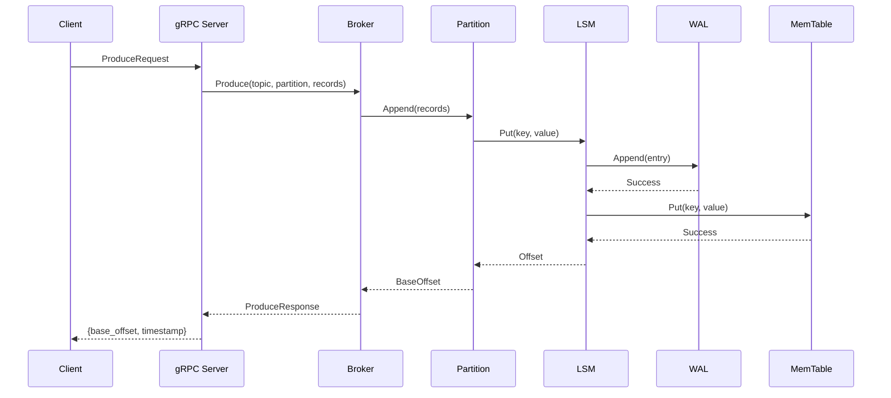
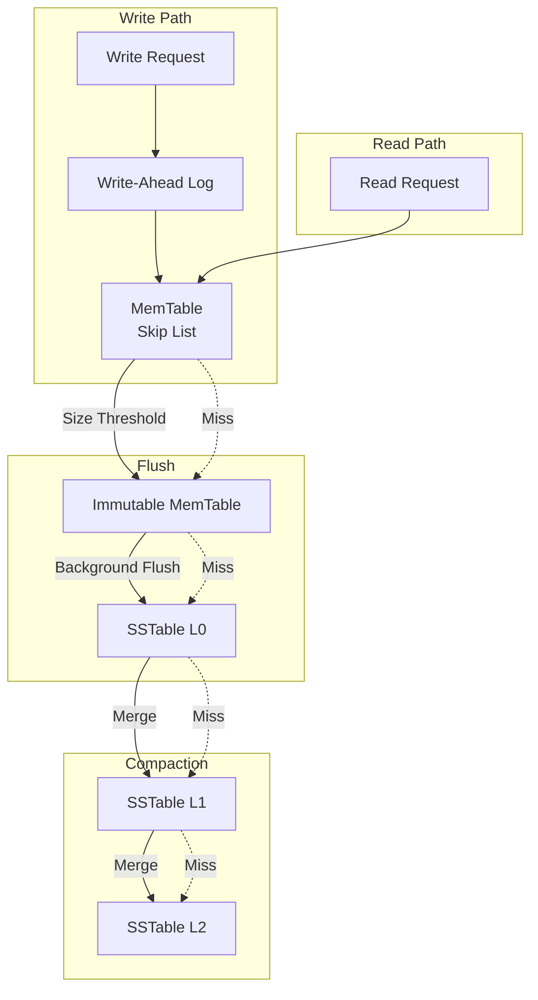
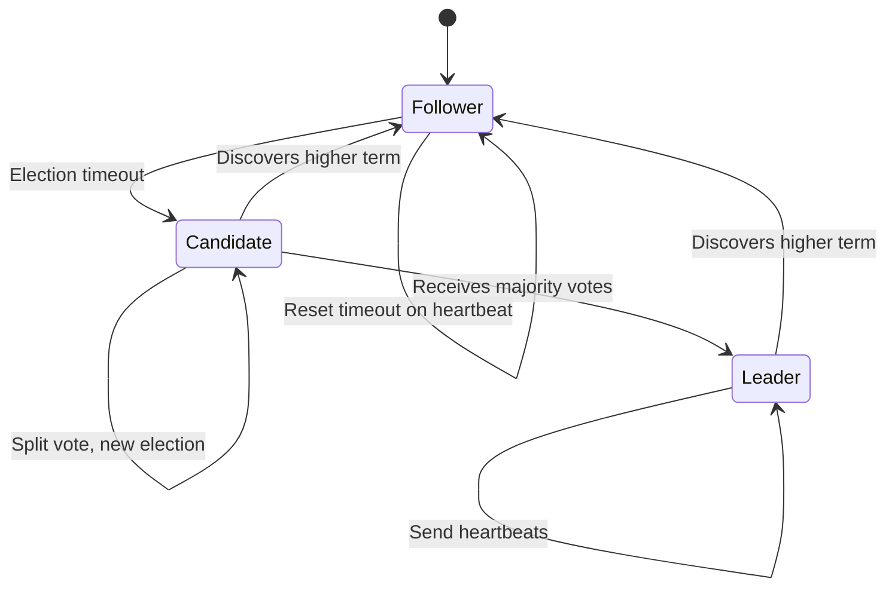
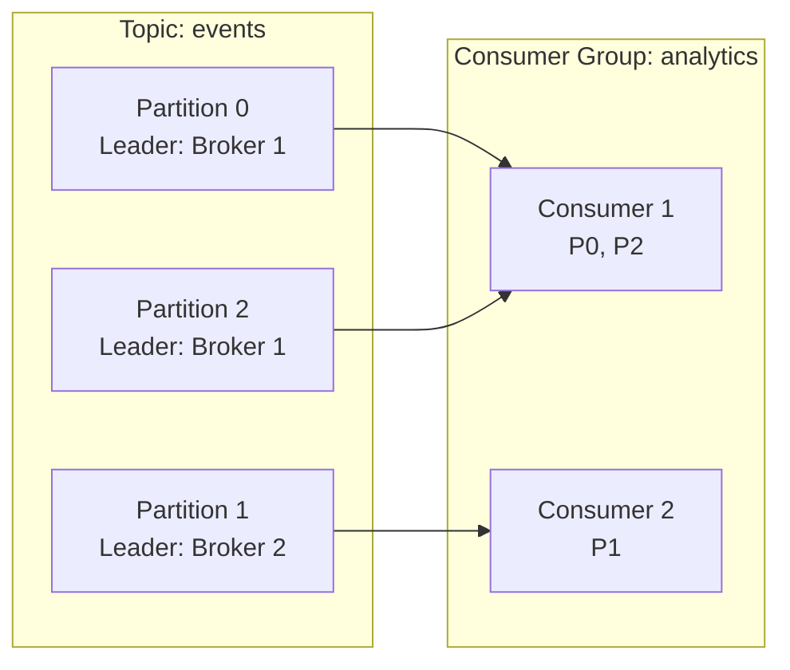

# Sentinel

**A high-throughput distributed log streaming engine written in Go**

[](https://github.com/matteso1/sentinel/actions/workflows/ci.yml)
[]()
[]()
[](LICENSE)

Sentinel is a Kafka-inspired distributed message queue built from the ground up. It features a custom LSM-tree storage engine, gRPC-based wire protocol, topic/partition data model, Raft-inspired consensus for fault tolerance, and Prometheus-compatible observability.

---

## Table of Contents

- [Features](#features)
- [Architecture](#architecture)
- [Components Deep Dive](#components-deep-dive)
- [Quick Start](#quick-start)
- [CLI Reference](#cli-reference)
- [Performance](#performance)
- [API Reference](#api-reference)
- [Project Structure](#project-structure)

---

## Features

### Storage Engine

- **Custom LSM-Tree**: Hand-written Log-Structured Merge tree optimized for write-heavy workloads
- **Skip List Memtable**: O(log n) in-memory data structure with concurrent read/write support
- **SSTable Format**: Block-based sorted string tables with CRC32 checksums for data integrity
- **Write-Ahead Log**: Durability guarantees with configurable sync modes and crash recovery

### Networking

- **gRPC API**: Efficient binary protocol using Protocol Buffers
- **Streaming Consume**: Server-side streaming for low-latency message delivery
- **Connection Management**: Graceful shutdown and error handling

### Message Model

- **Topics & Partitions**: Kafka-style data organization for horizontal scalability
- **Consumer Groups**: Automatic partition assignment with round-robin rebalancing
- **Partitioners**: Hash-based (key affinity) and round-robin distribution strategies

### Fault Tolerance

- **Raft Consensus**: Leader election with randomized timeouts to prevent split-brain
- **Log Replication**: AppendEntries RPC with conflict detection and fast backup
- **Commit Tracking**: Majority-based commit index advancement

### Observability

- **Prometheus Metrics**: `/metrics` endpoint with counters, gauges, and latency histograms
- **CLI Tools**: Command-line interface for producing, consuming, and managing topics

---

## Architecture

### System Overview



### Write Path



### LSM-Tree Storage Engine



### Raft Leader Election



### Topic/Partition Model



---

## Components Deep Dive

### Skip List (internal/storage/skiplist.go)

A probabilistic data structure providing O(log n) operations for the in-memory memtable:

- **XorShift64 PRNG**: Fast random level generation for node height
- **RWMutex**: Concurrent readers with exclusive writer access
- **Iterator Support**: Ordered traversal with seek capability

```go
// Core operations
Put(key, value []byte, timestamp uint64) int64
Get(key []byte) (value []byte, timestamp uint64, found bool)
Delete(key []byte, timestamp uint64) int64
```

### SSTable Format (internal/storage/sstable.go)

Immutable on-disk sorted key-value store with block-based layout:

```
┌─────────────────────────────────────┐
│ Data Block 0 (4KB)                  │
│   CRC32 | Length | Entry, Entry... │
├─────────────────────────────────────┤
│ Data Block 1 (4KB)                  │
├─────────────────────────────────────┤
│ ...                                 │
├─────────────────────────────────────┤
│ Index Block                         │
│   [firstKey, offset, size]...       │
├─────────────────────────────────────┤
│ Footer                              │
│   indexOffset | indexSize | count   │
│   minKey | maxKey | CRC32 | MAGIC   │
└─────────────────────────────────────┘
```

### Raft Consensus (internal/raft/)

Implementation of the Raft distributed consensus algorithm:

| Component | Description |
|-----------|-------------|
| `node.go` | State machine (Follower/Candidate/Leader), event loop, timers |
| `election.go` | Vote request/response, term management, log consistency checks |
| `replication.go` | AppendEntries RPC, commit index advancement, fast backup |

---

## Quick Start

### Prerequisites

- Go 1.24 or later

### Run the Server

```bash
git clone https://github.com/matteso1/sentinel.git
cd sentinel
go run ./cmd/sentinel-server --port 9092 --data ./data
```

### Produce Messages

```bash
go run ./cmd/sentinel-cli produce \
    -topic events \
    -message "Hello, World!" \
    -count 10
```

### Consume Messages

```bash
go run ./cmd/sentinel-cli consume \
    -topic events \
    -from-beginning \
    -max-messages 100
```

---

## CLI Reference

### produce

Send messages to a topic.

```bash
sentinel-cli produce [options]

Options:
  -broker    Broker address (default: localhost:9092)
  -topic     Topic name (required)
  -message   Message content
  -key       Message key for partitioning
  -partition Specific partition (-1 for auto)
  -count     Number of messages to send
```

### consume

Read messages from a topic.

```bash
sentinel-cli consume [options]

Options:
  -broker         Broker address (default: localhost:9092)
  -topic          Topic name (required)
  -partition      Partition to consume from (default: 0)
  -offset         Starting offset
  -from-beginning Start from earliest offset
  -max-messages   Maximum messages to read (default: 100)
```

### topics

List and describe topics.

```bash
sentinel-cli topics [options]

Options:
  -broker   Broker address (default: localhost:9092)
  -list     List all topics
  -describe Topic name to describe
```

---

## Performance

Benchmarks on Intel i9-13900HX:

| Operation | Throughput | Latency |
|-----------|------------|---------|
| Skip List Put | 1.7M ops/sec | 594 ns/op |
| Skip List Get | 3.9M ops/sec | 257 ns/op |
| LSM Put (with WAL) | 100K+ ops/sec | ~10 µs/op |

Memory efficiency: ~37 bytes overhead per key-value pair in memtable.

---

## API Reference

### Protobuf Service

```protobuf
service Sentinel {
    rpc Produce(ProduceRequest) returns (ProduceResponse);
    rpc Consume(ConsumeRequest) returns (stream Record);
    rpc FetchMetadata(MetadataRequest) returns (MetadataResponse);
}
```

### Metrics Endpoint

Prometheus-compatible metrics at `GET /metrics`:

| Metric | Type | Description |
|--------|------|-------------|
| `sentinel_messages_produced_total` | Counter | Total messages produced |
| `sentinel_messages_consumed_total` | Counter | Total messages consumed |
| `sentinel_bytes_produced_total` | Counter | Total bytes produced |
| `sentinel_active_connections` | Gauge | Current active connections |
| `sentinel_produce_latency_ms` | Gauge | Average produce latency |
| `sentinel_partition_lag` | Gauge | Consumer lag per partition |

---

## Project Structure

```
sentinel/
├── cmd/
│   ├── sentinel-server/     # Server entrypoint
│   │   └── main.go          # Flags, graceful shutdown
│   └── sentinel-cli/        # CLI client
│       └── main.go          # produce, consume, topics
├── internal/
│   ├── storage/             # LSM-tree storage engine
│   │   ├── skiplist.go      # Skip list data structure
│   │   ├── memtable.go      # In-memory buffer
│   │   ├── wal.go           # Write-ahead log
│   │   ├── sstable.go       # Sorted string tables
│   │   └── lsm.go           # Main coordinator
│   ├── broker/              # Message broker
│   │   ├── broker.go        # Topic management
│   │   ├── topic.go         # Topic abstraction
│   │   ├── partition.go     # Append-only log
│   │   ├── producer.go      # Partitioners
│   │   ├── consumer.go      # Poll/seek/commit
│   │   └── consumer_group.go# Rebalancing
│   ├── raft/                # Consensus
│   │   ├── node.go          # State machine
│   │   ├── election.go      # Leader election
│   │   └── replication.go   # Log replication
│   ├── server/              # gRPC server
│   │   └── grpc_server.go   # RPC handlers
│   └── metrics/             # Observability
│       └── prometheus.go    # Metrics collector
└── proto/                   # Protobuf definitions
    └── sentinel.proto       # Service + messages
```

---

## Testing

```bash
# Run all tests
go test -v ./...

# Run with coverage
go test -cover ./...

# Run benchmarks
go test -bench=. ./internal/storage/...
```

---

## License

MIT
